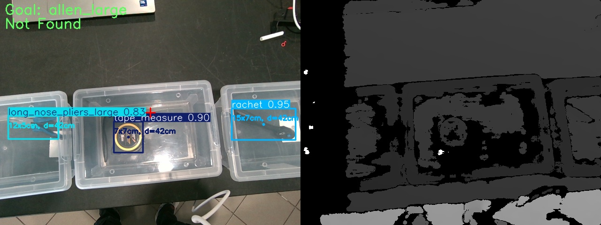
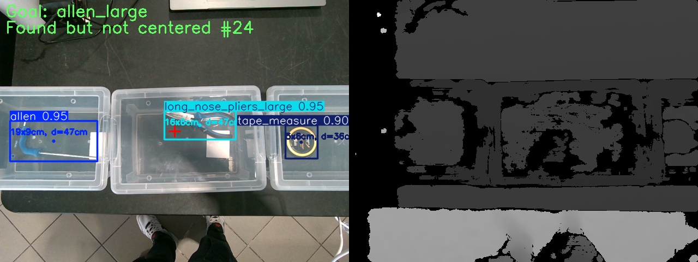
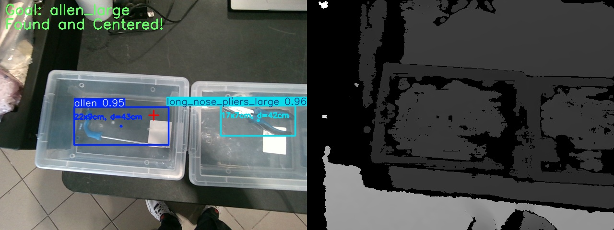

# 04 — Basic demo & how to use

The hello world ([`03`](03_installation_and_hello_world.md)) proves the install works. The **demo**
shows the module producing real detections — without any hardware — by replaying a recorded
RealSense RGB-D rosbag. This page covers the demo setup and then how to *use* the module: request
different tools, exercise size disambiguation and centering, and read the output.

## Set up the demo

1. **Download the sample rosbag.** The bag is a **571 MB zip** containing `boxes_0.db3` and
   `boxes_0.yaml` (the bag metadata — no reindex needed):

   **[Download boxes_0.zip](https://ntuagr-my.sharepoint.com/:u:/g/personal/nkardaris_ntua_gr/IQDsEQU6eugvT6m96_PWqJ7IARBPkaxEnLrxamZVtcMAVe0?download=1)**

   Unzip into a folder on your host (e.g. `~/rosbags/`) so you have `~/rosbags/boxes_0.db3` and
   `~/rosbags/boxes_0.yaml`.

   > **Topics in the bag:** `/camera/camera/color/image_raw` (`sensor_msgs/Image`, `bgr8`) and
   > `/camera/camera/depth/image_rect_raw` (`sensor_msgs/Image`, `16UC1`, mm) — these match the
   > defaults in `config/config.yaml`, so no remapping is required.

2. **Run the container with the bag folder and an output folder mounted:**

   ```bash
   docker run --rm -it --net=host \
       -v /absolute/path/to/rosbags:/cv_tool_ws/rosbags \
       -v /absolute/path/to/output:/cv_tool_ws/output_images \
       cv_tool:humble bash
   ```

   The second `-v` maps the container's annotated-image output directory to a host folder so you
   can view the saved frames directly. Images are written there only when `verbose: true` is set
   in `config.yaml`.

3. **Replay the bag and start the server:**

   ```bash
   source /cv_tool_ws/install/setup.bash
   ros2 launch cv_tool cv_tool_demo.launch.py bag_path:=/cv_tool_ws/rosbags/boxes_0.db3
   ```

4. **Send a goal** from a second shell into the same container
   (`docker exec -it <container_id> bash` → `source /cv_tool_ws/install/setup.bash`):

   ```bash
   ros2 action send_goal /detect_tool cv_tool_interfaces/action/Detect \
       "{tool_name: allen_large}" --feedback
   ```

   Expected server log:

   ```
   [cv_tool_action_server]: Received goal to detect: allen_large
   [cv_tool_action_server]: allen_large found and centered!
   ```

   Expected action client result:

   ```
   Feedback: current_status: 'Scanning frame 12 for allen_large...'
   ...
   Result:
     success: true
     center: {x: ..., y: ..., z: ...}
     top_left: {x: ..., y: ..., z: ...}
     bottom_right: {x: ..., y: ..., z: ...}
     confidence: 0.9...
   ```

The scenarios below all run with this replay active.

## Scenario A — request different tools

The sample rosbag contains the following tools: `allen_small`, `allen_large`, `long_nose_pliers_large`,
`tape_measure`, `rachet`. Send a goal for any of them:

```bash
ros2 action send_goal /detect_tool cv_tool_interfaces/action/Detect "{tool_name: allen_large}" --feedback
ros2 action send_goal /detect_tool cv_tool_interfaces/action/Detect "{tool_name: tape_measure}" --feedback
ros2 action send_goal /detect_tool cv_tool_interfaces/action/Detect "{tool_name: long_nose_pliers_large}" --feedback
ros2 action send_goal /detect_tool cv_tool_interfaces/action/Detect "{tool_name: rachet}" --feedback
```

Each goal streams `Scanning frame N ...` feedback until the requested tool is detected and centered,
then returns `success: true` with the 3D keypoints and confidence. Requesting a tool that is not in
the current view simply keeps scanning (cancel with `Ctrl-C`).

## Scenario B — size disambiguation (small vs large)

The model emits a generic `allen` class; the module resolves the size from the depth-derived metric
width/height. Request the small and large variants and compare results:

```bash
ros2 action send_goal /detect_tool cv_tool_interfaces/action/Detect "{tool_name: allen_small}" --feedback
ros2 action send_goal /detect_tool cv_tool_interfaces/action/Detect "{tool_name: allen_large}" --feedback
```

Only the variant whose measured size matches the threshold is accepted (default 0.17 m width/height,
configurable via `size_disambiguation` in `config.yaml`). With
`verbose: true`, the saved annotated frame shows the measured `WxH cm, d=cm` label per detection.

## Scenario C — centering-stability behaviour

A detection is accepted only when the tool stays centered within `margin_x`/`margin_y` pixels for
`buffer_size` consecutive frames (defaults 70/70 px, 8 frames). To see the effect, edit
[`config/config.yaml`](../cv_tool_ws/src/cv_tool/config/config.yaml):

- Lower `buffer_size` → accepts faster, less stable.
- Tighten `margin_x/y` → requires the tool nearer the image centre (as during the arm sweep in the
  demonstrator).

Rebuild/re-source after editing (or mount an external config and pass its path with `--config`).

## Reading the output

| Field | Meaning |
|---|---|
| `success` | `true` only on a stable, centered detection above `conf_thres`. |
| `center` / `top_left` / `bottom_right` | 3D points (metres) in the camera color optical frame, for the grasp step. |
| `confidence` | YOLO confidence of the accepted detection. |
| feedback `current_status` | Live scan progress. |

With `verbose: true`, annotated RGB+depth composites are written to the mounted output folder
(bounding boxes, class+confidence, measured size, centre marker, goal/status overlay). The three
frames below show the typical progression for an `allen_large` goal:

<table>
<tr>
<td align="center"><br/><em>Scanning — allen_large not yet in view</em></td>
<td align="center"><br/><em>Detected but outside centering margin</em></td>
<td align="center"><br/><em>Stable, centered detection — goal succeeds</em></td>
</tr>
</table>

## Tips

- The CV result is **frame-relative**; the demonstrator pairs it with the arm sweep (it stops the
  motion when the tool is centered). Standalone, expect the goal to succeed whenever the bag loop
  brings the requested tool through the centred region.
- For a different camera, update `camera_intrinsics` and the topic names in the config.
