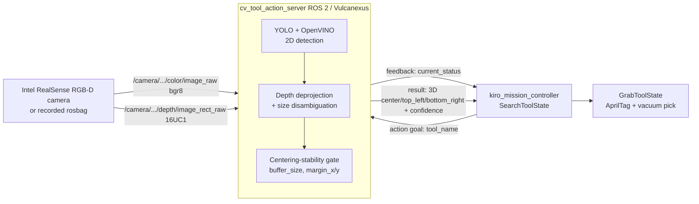
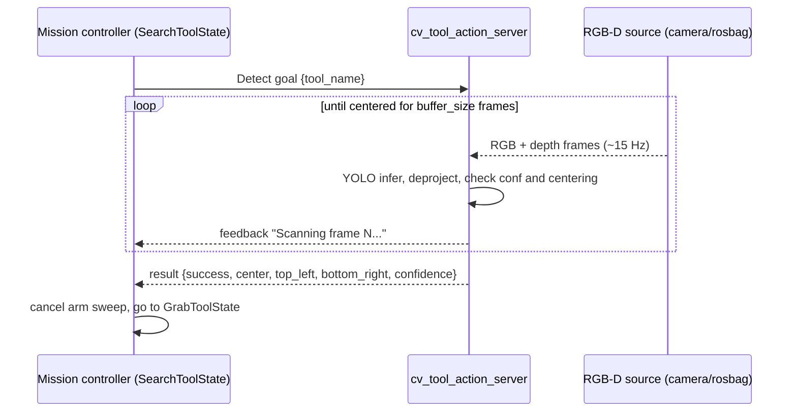

# Architecture & data flow

## Component / data-flow diagram

How `cv_tool` fits between the camera and the KIRO mission controller.

```mermaid
flowchart LR
    cam[Intel RealSense RGB-D camera<br/>or recorded rosbag] -->|/camera/.../color/image_raw bgr8| node
    cam -->|/camera/.../depth/image_rect_raw 16UC1| node

    subgraph node[cv_tool_action_server  ROS 2 / Vulcanexus]
        yolo[YOLO + OpenVINO<br/>2D detection] --> deproj[Depth deprojection<br/>+ size disambiguation]
        deproj --> gate[Centering-stability gate<br/>buffer_size, margin_x/y]
    end

    mc[kiro_mission_controller<br/>SearchToolState] -->|action goal: tool_name| node
    node -->|feedback: current_status| mc
    node -->|result: 3D center/top_left/bottom_right + confidence| mc
    mc --> grab[GrabToolState<br/>AprilTag + vacuum pick]
```

## Sequence — a `Detect` goal

```mermaid
sequenceDiagram
    participant MC as Mission controller (SearchToolState)
    participant CV as cv_tool_action_server
    participant CAM as RGB-D source (camera/rosbag)

    MC->>CV: Detect goal {tool_name}
    loop until centered for buffer_size frames
        CAM-->>CV: RGB + depth frames (~15 Hz)
        CV->>CV: YOLO infer, deproject, check conf and centering
        CV-->>MC: feedback "Scanning frame N..."
    end
    CV-->>MC: result {success, center, top_left, bottom_right, confidence}
    MC->>MC: cancel arm sweep, go to GrabToolState
```

